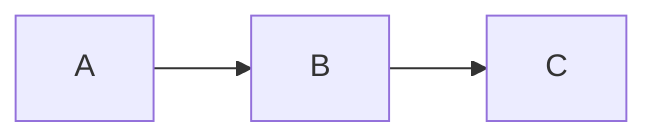

# Obsidian Advanced Slides — complete syntax reference

This file documents all syntax features of the obsidian-advanced-slides plugin. Use it as the authoritative source when generating slide content.

Documentation source: https://mszturc.github.io/obsidian-advanced-slides/

## Table of contents

1. Frontmatter options
2. Slide separators (horizontal and vertical)
3. Speaker notes
4. Slide backgrounds
5. Slide and element annotations
6. Fragments and fragmented lists
7. Layout: Split component
8. Layout: Grid component
9. Templates
10. Themes
11. Inline styling
12. Block comments
13. Charts, Mermaid, Math, Code blocks
14. Icons and Emojis
15. Plugins (Menu, Overview, Chalkboard, Timer, Pointer)
16. Slide animation
17. Images and Embeds

---

## 1. Frontmatter options

Place YAML frontmatter at the very top of the `.md` file between `---` fences.

| Property | Description | Values | Default |
|---|---|---|---|
| width | Presentation width in px | number | 960 |
| height | Presentation height in px | number | 700 |
| margin | Empty space around content | number | 0.04 |
| minScale | Min scale for content | number | 0.2 |
| maxScale | Max scale for content | number | 2.0 |
| theme | Slide theme | black, white, league, beige, sky, night, serif, simple, solarized, blood, moon, consult, or custom CSS path | black |
| highlightTheme | Code highlight theme | zenburn, monokai, css/vs2015.css, or custom | zenburn |
| controls | Navigation arrows | true/false | true |
| controlsLayout | Arrow position | edges, bottom-right | bottom-right |
| progress | Progress bar | true/false | true |
| slideNumber | Show slide number | true/false | false |
| center | Vertical centering | true/false | true |
| loop | Loop presentation | true/false | false |
| rtl | Right-to-left | true/false | false |
| shuffle | Random slide order | true/false | false |
| fragments | Enable fragments globally | true/false | true |
| showNotes | Show notes to all viewers | true/false | false |
| autoSlide | Auto-advance (ms) | number | 0 |
| transition | Transition style | none, fade, slide, convex, concave, zoom | slide |
| transitionSpeed | Transition speed | default, fast, slow | default |
| overview | Enable overview mode | true/false | true |
| bg | Default background for all slides | color/URL | #ffffff |
| enableLinks | Enable backlinks | true/false | false |
| enableOverview | Overview button | true/false | false |
| enableChalkboard | Chalkboard plugin | true/false | false |
| enableTimeBar | Elapsed time bar | true/false | false |
| timeForPresentation | Time bar duration (s) | number | 120 |
| defaultTemplate | Template for all slides | `[[template-note]]` or null | null |
| notesSeparator | Custom notes delimiter | string | `note:` |
| separator | Horizontal slide separator regex | string | `^( ?| )---( ?| )$` |
| verticalSeparator | Vertical slide separator regex | string | `^( ?| )--( ?| )$` |
| css | Additional CSS files | array | [] |

Additional reveal.js config options can also be passed: https://revealjs.com/config/

---

## 2. Slide separators

**Horizontal slides** (main flow, left-right navigation):
```
# Slide 1

---

# Slide 2
```
Use three dashes (`---`) surrounded by blank lines above and below.

**Vertical slides** (sub-slides, up-down navigation):
```
# Slide 2.1

--

# Slide 2.2
```
Use two dashes (`--`) surrounded by blank lines above and below.

---

## 3. Speaker notes

Add `note:` on its own line after the slide content. Everything after `note:` until the next slide separator becomes speaker notes.

```
## My slide title

Visible content here.

note: This text only appears in speaker view (press S in browser).

- You can use bullet points in notes
- And even images: 
```

The notes separator can be customized via the `notesSeparator` frontmatter property.

To view notes: open Slide Preview → click "Open in Browser" → press `S`.

**Alternative syntax using `Notes:` (capital N):** Some users use `Notes:` — both work identically.

---

## 4. Slide backgrounds

Annotate a slide with a comment at its start:

```
<!-- slide bg="aquamarine" -->
## Slide with color background

---

<!-- slide bg="#ff0000" -->
## Hex color

---

<!-- slide bg="rgb(70, 70, 255)" -->
## RGB color

---

<!-- slide bg="https://example.com/image.jpg" -->
## Image background

---

<!-- slide bg="[[local-image.jpg]]" -->
## Local image background (Obsidian syntax)

---

<!-- slide bg="https://example.com/image.jpg" data-background-opacity="0.5" -->
## With opacity (0.0 to 1.0)
```

Set a default background for all slides via frontmatter:
```yaml
bg: '#1a1a2e'
```

Set transparent background for OBS overlay use:
```yaml
bg: transparent
```

---

## 5. Slide and element annotations

### Slide annotations
Place at the very start of a slide (after the separator):
```
<!-- slide class="my-class" style="font-size:20px" data-auto-animate -->
```

Common slide annotation attributes: `bg`, `data-background-opacity`, `data-background-size`, `data-background-position`, `data-background-repeat`, `data-auto-animate`, `class`, `style`.

### Element annotations
Place immediately after any element (on the same line or the next line):
```
text with border <!-- element class="with-border" -->

text with background <!-- element style="background:blue" -->

text with data attribute <!-- element data-toggle="modal" -->
```

---

## 6. Fragments and fragmented lists

### Fragments on individual elements
```
Fade in <!-- element class="fragment" -->

Fade out <!-- element class="fragment fade-out" -->

Highlight red <!-- element class="fragment highlight-red" -->

Fade in, then out <!-- element class="fragment fade-in-then-out" -->

Slide up while fading in <!-- element class="fragment fade-up" -->
```

Fragment types: fade-in (default), fade-out, fade-up, fade-down, fade-left, fade-right, fade-in-then-out, fade-in-then-semi-out, highlight-red, highlight-blue, highlight-green, highlight-current-red, highlight-current-blue, highlight-current-green, grow, shrink, strike, semi-fade-out.

Control order with `data-fragment-index`:
```
- Appear Fourth <!-- element class="fragment" data-fragment-index="4" -->
- Appear First <!-- element class="fragment" data-fragment-index="1" -->
```

### Fragmented lists (automatic)

**Unordered:** use `+` instead of `-`:
```
- Always visible item
+ Appears first
+ Appears second
+ Appears third
```

**Ordered:** use `)` instead of `.`:
```
1. Always visible
2) Appears first
3) Appears second
```

---

## 7. Layout: Split component

The `<split>` tag divides slide content into columns. Children are separated by blank lines.

### Even split
```
<split even>

Column 1 content

Column 2 content

Column 3 content

</split>
```

### With gap
```
<split even gap="3">

Column 1

Column 2

</split>
```
Gap value is in `em` units.

### Proportional split
```
<split left="2" right="1" gap="2">

Main content (2/3 width)

Sidebar content (1/3 width)

</split>
```

### Wrap (multi-row)
```
<split wrap="3">

Item 1

Item 2

Item 3

Item 4

Item 5

</split>
```
Creates rows of 3 items each.

### No margin
```
<split no-margin>

Item 1

Item 2

</split>
```

---

## 8. Layout: Grid component

The `<grid>` tag positions content absolutely on the slide using drag-and-drop semantics.

### Basic syntax
```
<grid drag="width height" drop="x y">
Content here
</grid>
```

Values are percentages of slide dimensions by default. Append `px` for pixel values.

### Position by coordinates
- Positive x: from left edge
- Negative x: from right edge
- Positive y: from top edge
- Negative y: from bottom edge

```
<grid drag="60 55" drop="5 10" bg="red">
Main content
</grid>

<grid drag="25 55" drop="-5 10" bg="green">
Sidebar
</grid>

<grid drag="90 20" drop="5 -10" bg="gray">
Footer bar
</grid>
```

### Named positions
Available: center, top, bottom, left, right, topleft, topright, bottomleft, bottomright

```
<grid drag="40 30" drop="topleft" bg="red">
Top Left
</grid>

<grid drop="right" bg="green">
Right (default size 50x100)
</grid>
```

### Flow
```
<grid drag="40 100" drop="center" bg="coral" flow="col">
Item 1
![[image.jpg]]
Item 3
</grid>
```
- `flow="col"` (default): children stack vertically
- `flow="row"`: children arrange horizontally

### Grid attributes reference

| Attribute | Syntax | Description |
|---|---|---|
| drag | `"width height"` | Size of grid area (% or px) |
| drop | `"x y"` or named position | Position on slide |
| flow | `col` or `row` | Child layout direction |
| bg | CSS color | Background color |
| border | `"width style color"` | Border (e.g., `"thick dotted blue"`) |
| animate | `"type [speed]"` | Animation (fadeIn, slideRightIn, scaleUp, etc.) |
| opacity | `0.0` to `1.0` | Transparency |
| filter | blur, bright, contrast, grayscale, hue, invert, saturate, sepia | CSS filter |
| rotate | `-360` to `360` | Rotation in degrees |
| pad | `"top right bottom left"` | Internal padding (px) |
| align | left, right, center, justify, top, bottom, topleft, etc., stretch | Content alignment |
| justify-content | start, center, space-between, space-around, space-evenly, end | Space distribution |
| frag | positive integer | Fragment index for reveal order |
| style | any CSS | Inline styles |
| class | any class name | CSS classes |

### Animation types
fadeIn, fadeOut, slideRightIn, slideLeftIn, slideUpIn, slideDownIn, slideRightOut, slideLeftOut, slideUpOut, slideDownOut, scaleUp, scaleUpOut, scaleDown, scaleDownOut. Optional speed: `slower` or `faster`.

---

## 9. Templates

Templates are separate `.md` notes in the Obsidian vault that define reusable slide layouts.

### Template file (e.g., `tpl-footer.md`):
```
<% content %>

<grid drag="100 6" drop="bottom">
<% footer %>
</grid>
```

Every template MUST contain `<% content %>`. Optional sections use `<%? variable %>`.

### Using a template in a slide:
```
<!-- slide template="[[tpl-footer]]" -->

# Main content goes here

This is placed into the `content` variable automatically.

::: footer
Footer text goes here
:::
```

### Default template (applied to all slides):
```yaml
---
defaultTemplate: "[[tpl-footer]]"
---
```

### Block comments for template variables:
```
::: variablename
Content for this variable
:::
```

---

## 10. Themes

Built-in themes: black (default), white, league, beige, sky, night, serif, simple, solarized, blood, moon, consult.

```yaml
---
theme: night
---
```

Custom theme from vault:
```yaml
theme: css/my-theme.css
```
Place CSS file in `.obsidian/plugins/obsidian-advanced-slides/css/`.

Custom theme from URL:
```yaml
theme: https://revealjs-themes.dzello.com/css/theme/robot-lung.css
```

### Highlight themes
Built-in: zenburn (default), monokai, css/vs2015.css.
```yaml
highlightTheme: monokai
```

### Theme selection guide
- **Dark presentations (projector):** black, night, blood, moon, league
- **Light presentations (screen share):** white, beige, serif, simple, sky, solarized
- **Professional/consulting:** consult
- **Academic/formal:** serif, simple

---

## 11. Inline styling

Apply CSS styles directly to elements:
```
This text is red <!-- element style="color: red;" -->
```

Define `<style>` blocks within a slide:
```
<style>
.custom-class {
    color: #ff6600;
    font-size: 1.2em;
}
</style>

Styled text <!-- element class="custom-class" -->
```

---

## 12. Block comments

Used primarily with templates. Invisible in the rendered slide unless consumed by a template variable:

```
::: blockname
Content here — only visible if the template uses `<% blockname %>`
:::
```

---

## 13. Charts, Mermaid, Math, Code blocks

### Mermaid diagrams
````

````

### Math (LaTeX)
Inline: `$E = mc^2$`
Block:
```
$$
\sum_{i=1}^{n} x_i
$$
```

### Code blocks
````
```python
def hello():
    print("Hello, World!")
```
````

### Charts (Chart.js via plugin)
````
```chart
type: bar
labels: [Mon, Tue, Wed]
series:
  - title: Sales
    data: [12, 19, 3]
```
````

---

## 14. Icons and Emojis

### Font Awesome icons
```
:fas_home: Home icon
:fab_github: GitHub icon
```
Use underscore `_` instead of hyphen in icon names.

### Emojis
```
:smile: :rocket: :100:
```

---

## 15. Plugins

### Menu
Adds a hamburger menu for slide navigation.
Enable via settings (not frontmatter).

### Overview
```yaml
enableOverview: true
```
Adds a button to see all slides in a grid overview.

### Chalkboard
```yaml
enableChalkboard: true
```
Allows drawing on slides during presentation. Toggle with keyboard shortcuts.

### Elapsed time bar
```yaml
enableTimeBar: true
timeForPresentation: 900
```
Shows a progress bar counting down presentation time (value in seconds).

### Laser pointer
Enable via plugin settings. Turns cursor into a red laser dot during presentation.

---

## 16. Slide animation

Auto-animate between slides with matching elements:
```
<!-- slide data-auto-animate -->
# Title

---

<!-- slide data-auto-animate -->
# Title
## Subtitle that appears with animation
```

Transition overrides per slide:
```
<!-- slide data-transition="zoom" -->
## This slide zooms in

---

<!-- slide data-transition="fade-in slide-out" -->
## Fade in, slide out
```

---

## 17. Images and Embeds

### Obsidian image syntax
```
![[photo.jpg]]
![[photo.jpg|300x200]]     <!-- with size -->
![[photo.jpg|300]]          <!-- width only -->
```

### Standard markdown images
```

```

### Embed other notes
```
![[OtherNote]]
![[OtherNote#Section]]
```

### Embed with internal links
```
[[Note]]                    <!-- rendered as text in slides -->
[[Note|Display Text]]       <!-- with alias -->
```

---

## Design patterns for common slide types

### Title slide
```
<!-- slide bg="https://example.com/hero.jpg" data-background-opacity="0.3" -->

# Presentation title
### Subtitle or date

note: Welcome remarks and agenda overview.
```

### Section divider
```
---

<!-- slide bg="#2c3e50" -->

## Section name

note: Transition to new section. Brief overview of what's coming.

---
```

### Two-column content
```
## Topic name

<split left="2" right="1" gap="2">

Main content with detailed explanation goes here. This column is twice the width.

Key takeaway or supporting image.

</split>

note: Explain the main content. Reference the sidebar.
```

### Image showcase
```
## Visual comparison

<split even gap="1">

![[before.png]]

![[after.png]]

</split>

note: Point out specific differences between before and after.
```

### Key stat or quote
```
---

<!-- slide bg="#1a1a2e" -->

<grid drag="80 40" drop="center" align="center">

## 73%

###### of users reported improved outcomes

</grid>

note: This stat comes from the Q3 survey. Emphasize the significance.

---
```

### Closing slide
```
---

<!-- slide bg="#2c3e50" -->

## Thank you

Questions?

note: Open for questions. If no questions, recap the three key points.
```
